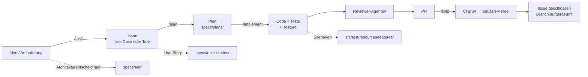

# Spec Flow — Spec-Driven Development in CaseFlow

Diese Anleitung beschreibt den Arbeitsfluss von der Idee bis zum gemergten Code.
Leitprinzip: **Die Spezifikation kommt zuerst, der Code folgt ihr.** Jede
Änderung hinterlässt eine nachvollziehbare Spur — Issue → Spec → Plan → Code +
Tests → PR — und automatische Guardrails halten Spec und Code synchron.

## Der Fluss in einem Bild



Kurzformen bündeln mehrere Schritte:

- **`/fast`** = `/task` + `/plan` + `/implement` (Plan-Bestätigung nur bei
  nicht-trivialen Issues).
- **`/autoship`** = kompletter Durchlauf inklusive Merge und Aufräumen, **ohne
  Rückfragen**.

## Die Artefaktkette

| Stufe | Artefakt | Ort | Erzeugt/gepflegt von |
| --- | --- | --- | --- |
| Anforderung | Issue (Use Case oder Task) | Git-Provider | `/task` |
| Spezifikation | User Story | `specs/user-stories/<nr>-<slug>.md` | `/implement` (Setup) |
| Architekturentscheid | ADR | `specs/adr/adr-<NN>-<slug>.md` | `/adr` |
| Bauplan | Implementierungsplan | `specs/plans/us-<nr>-*.md` | `/plan` |
| Verhalten | Cucumber-Szenarien | `src/test/resources/features/<bereich>/` | `/implement` |
| Umsetzung | Produktions- und Testcode | `src/main/**`, `src/test/**` | `/implement` |
| Auslieferung | Pull Request → `main` | Git-Provider | `/implement`, `/ship` |

Die User Story ist die zentrale Einstiegsstelle: Sie verweist auf das Issue, auf
die Plan-Datei (Backlink) und auf die `.feature`-Datei. So ist die Traceability
Issue → Plan → Tests jederzeit lesbar.

## Die Skills und wann du sie nutzt

Alle Skills laufen **nur auf ausdrücklichen Aufruf** (`/name`), nie von selbst.

| Skill | Zweck | Typischer Einsatz |
| --- | --- | --- |
| `/task` | Strukturiertes Issue erstellen, Lücken interaktiv klären | Neue Anforderung, noch kein Issue |
| `/plan` | Issue analysieren, Implementierungsplan schreiben | Vor der Umsetzung nicht-trivialer Issues |
| `/implement` | Branch, Umsetzung, BDD, Reviewer, Tests, PR | Bestätigtes Issue umsetzen |
| `/ship` | CI abwarten, squash-mergen, Issue schliessen, aufräumen | Nach `/implement`, PR ist fertig |
| `/fast` | `task` + `plan` + `implement` in einem Durchlauf | Kleine bis mittlere Features zügig starten |
| `/autoship` | Alles inkl. Merge ohne Rückfragen | Autonomer End-to-End-Lauf, Night-Batch |
| `/fix-e2e` | E2E-Suite iterativ grün bekommen | Rote Cucumber-/Playwright-Tests |
| `/adr` | Architekturentscheid als Record festhalten | Bewusste, dokumentierbare Architekturentscheidung |

## Plan-Gate: wann ein Plan Pflicht ist

`/implement` verlangt einen bestätigten Plan unter `specs/plans/`, sobald das
Issue nicht-trivial ist. Als nicht-trivial gilt jede dieser Heuristiken:

- Use-Case-Issue mit **mehr als 3 Akzeptanzkriterien**
- berührt **mehr als eine Schicht** (z. B. Domain + Adapter + Frontend)
- berührt **Migration (Liquibase), Auth/Security, Audit-Trail** oder Breaking Changes

Fehlt der Plan, läuft erst `/plan`. Triviale Tasks (einzelne Datei, keiner der
Punkte) gehen ohne Plan direkt in die Umsetzung. `/autoship` schreibt bei
nicht-trivialen Issues automatisch ein Plan-Artefakt — ohne auf Bestätigung zu
warten.

## BDD: von der Story zum lauffähigen Test

Jede User Story bringt ihre Szenarien mit. Das Runner-Routing:

- **Java-Cucumber-Runner** (kein Tag) — über die REST-API testbar: Fall-CRUD,
  Zuweisung, Fristen, Auth, Persistenz.
- **Playwright (`@E2E`)** — Browser nötig: Formulare, Übersichten, Navigation.
- **Beide** — Story in Backend- und Frontend-Anteil splitten.
- **Nur Vitest** — reine Parser-/Berechnungslogik: keine `.feature`, Abdeckung in
  der Story dokumentieren.

`@Pending` ist **kein** Abschlusszustand — das Feature muss real laufen.

## Guardrails: was den Fluss erzwingt

Der Build bricht, wenn die Spec-Disziplin verletzt wird — nicht erst ein Reviewer
merkt es:

- **`HexagonArchitectureTest`** — Hexagonal-Schichtdisziplin (ArchUnit).
- **`SpecScenarioParityTest`** — jede `.feature`, die eine `US-<n>` referenziert,
  muss dieselbe Anzahl Szenarien führen wie `specs/user-stories/<n>-*.md`. So
  driftet die Spezifikation nicht von den Tests weg.
- **`DisplayTextTransliterationTest`** — keine ASCII-Transliteration (`ae`/`ue`/
  `oe`) in kundensichtbarem Angular-Text; Umlaute sind Pflicht.
- **Definition of Done** — vor jedem Commit abgeglichen (siehe
  `.github/skills/_shared/dod-checklist.md`).

## Reviewer-Agenten

Nach der Umsetzung, vor dem Commit, laufen die passenden Custom Agents. Ein
PostToolUse-Hook erinnert nach Edits automatisch an den richtigen:

| Agent | Prüft | Trigger |
| --- | --- | --- |
| `hexagonal-reviewer` | Ports/Adapters, DDD-Bausteine | `src/main/java/**` geändert |
| `angular-signals-reviewer` | Signals, OnPush, `@if`/`@for`, `inject()` | `src/main/webapp/src/app/**` geändert |
| `auth-security-reviewer` | OIDC/Keycloak, Rollen, BFF-Cookies | REST-Resource, `application*.properties`, `keycloak/**` |
| `bdd-cucumber-author` | Tag-Routing der `.feature`-Dateien | `.feature` neu/geändert |

## Drei typische Abläufe

### 1. Vollständiges Feature (kontrolliert)

```text
/task   Beschreibe das Feature → Issue #42 entsteht
/plan   42  → Plan in specs/plans/, prüfen und bestätigen
/implement 42  → Branch, Code + Tests + .feature, Reviewer, PR
/ship          → CI abwarten, squash-mergen, Issue schliessen, aufräumen
```

### 2. Kleines Feature (zügig)

```text
/fast Beschreibe das Feature
      → Issue + (bei Bedarf) Plan + Implementierung in einem Durchlauf
/ship → abschliessen
```

### 3. Technischer Task ohne UI

```text
/task Refactoring/CI/Dependency beschreiben → Issue mit Label maintenance
/implement <nr>  → keine .feature, dafür Unit-/Integrationstests
/ship
```

### 4. Architekturentscheid festhalten

```text
/adr Beschreibe die Entscheidung
     → specs/adr/adr-NN-<slug>.md + Index + mkdocs-Navigation aktualisiert
```

## Sprache und Konventionen

- Deutsch, Schweizer Hochdeutsch ohne `ß`, Du-Form, **korrekte Umlaute** in allem
  für Menschen Lesbaren (Fliesstext, Kommentare, Commit-Messages, UI-Text).
- ASCII-Transliteration (`ae`/`ue`/`oe`/`ss`) **nur** in Identifiern, die per
  Konvention ASCII bleiben: Java-Enum-Konstanten, JSON-Keys, Cucumber-Tags,
  Branch-Namen, Datei-Slugs.
- Feature-Titel: `US-<nr> <Kurztitel>` — der `SpecScenarioParityTest` verknüpft
  Feature und Story darüber.

## Weiterführend

- User Stories und Traceability: [User Stories — Übersicht](user-stories/README.md)
- Architekturentscheide: [ADR — Übersicht](adr/README.md)
- Architektur im Detail: [arc42-Dokumentation](caseflow-arc42.md)
- Repository-weite Regeln: `.github/copilot-instructions.md`
- Skill-Definitionen: `.github/skills/<name>/SKILL.md`
